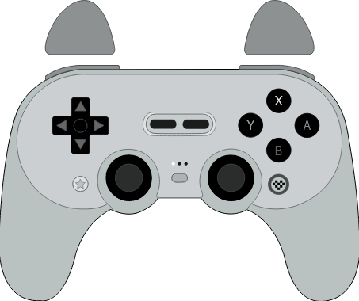

# GamePad Viewer Skin: 8BitDo Pro 2
A skin for [GamePad Viewer](https://www.gamepadviewer.com/) themed around the [8BitDo Pro 2](https://www.8bitdo.com/pro2/) controller.

## Usage
Browser Source URL: [https://gamepadviewer.com/?p=1&css=https://davidf-dev.github.io/GPV-8bitdo-pro2-skin/8bitdopro2.css](https://gamepadviewer.com/?p=1&css=https://davidf-dev.github.io/GPV-8bitdo-pro2-skin/8bitdopro2.css)

Alternatively, visit [GamePad Viewer](https://gamepadviewer.com/#generate) and generate your own customised URL; be sure to provide the necessary [Custom CSS URL](https://davidf-dev.github.io/GPV-8bitdo-pro2-skin/8bitdopro2.css).

## Acknowledgements
Credit to [JotaGo](https://gist.github.com/JotaGo/84e9c728a259d4b40e9fe969ae1aec00) (modified code and assets).

Massive thanks to the [GamePad Viewer Discord](https://discord.gg/0SdzYaRROBqfdd0v) for help with fixing the original code.
